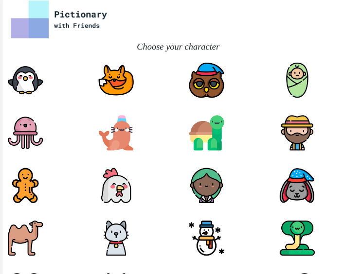

<h1 align="center"> Pictionary with Friends </h1>

	<strong>
		•
		<a href="https://aqueous-ravine-28405.herokuapp.com/">Website</a>
		•
	</strong>

## Table of Contents

- [About](#about)
- [Features](#features)
- [In progress](#in-progress)
- [Future goals](#future-goals)
- [Resources](#resources)
- [Demo Images](#demo-images)
- [How can I help?](#how-can-i-help)

## About?
[Pictionary with Friends](https://aqueous-ravine-28405.herokuapp.com/) is an passion project built by a curious yet lonely programer over quarantine. The project is hosted on [heroku](https://heroku.com/). The site allows for a maximum of 20 users to actively play, currently, due to constraints of the free version of heroku.

## Features

The project currently has the following features:

* Character selection
* Game room creation
* Joining existing games
* Lobby room with Chat and characters displayed
* Game room with characters displayed
* Chat box in game to provide answers
* Canvas
* Local cookie allows user to save and access the character selected, score and other data

## In-progress

The features I am currently working on:

* User turns
* Allowing user to select time, number of rounds
* Leader board, change position accordning to points

## Future-goals

I look to incorporate the following features in the near future:

* Client turns update 
* More drawing capabilities
* AI bot to play against
* Ability to handle large traffic to the site

## Resources

* **Node.js** An open-source, cross-platform JavaScript runtime environment.
* **Linux** Makes my life easier
* **Chat** Chat using sockets [generic template](https://socket.io/demos/chat/)
* **Canvas drawing** Drawing on canvas using sockets [generic template](https://socket.io/demos/whiteboard/)
* **Palette selection** Made easier through the following [website](http://colorsafe.co/). Thanks to Adrian Rapp and Donielle Berg

## Demo images

Character selection page

Lobby page

Game page

## How can I help?

1. Fork this repo
2. Create your feature branch (`git checkout -b my-new-awesome-feature`)
3. Commit your changes (`git commit -am 'My feature'`)
4. Push to the branch (`git push origin my-new-awesome-feature`)
5. Create a new pull request
